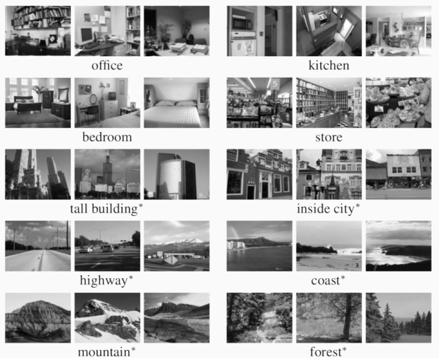
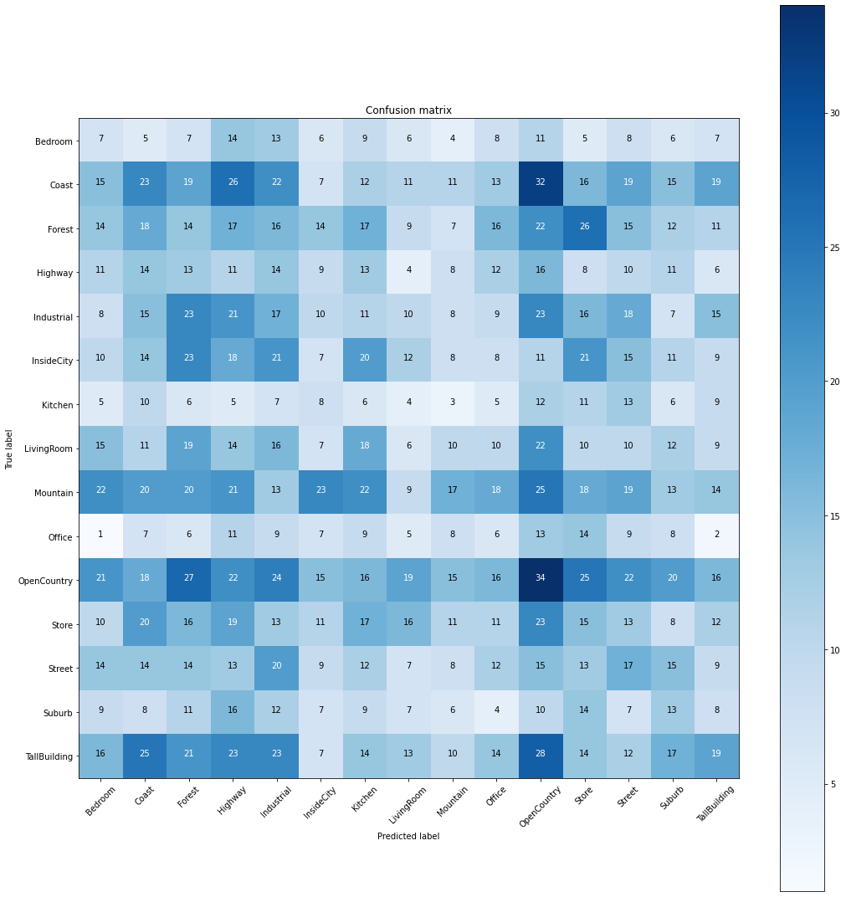
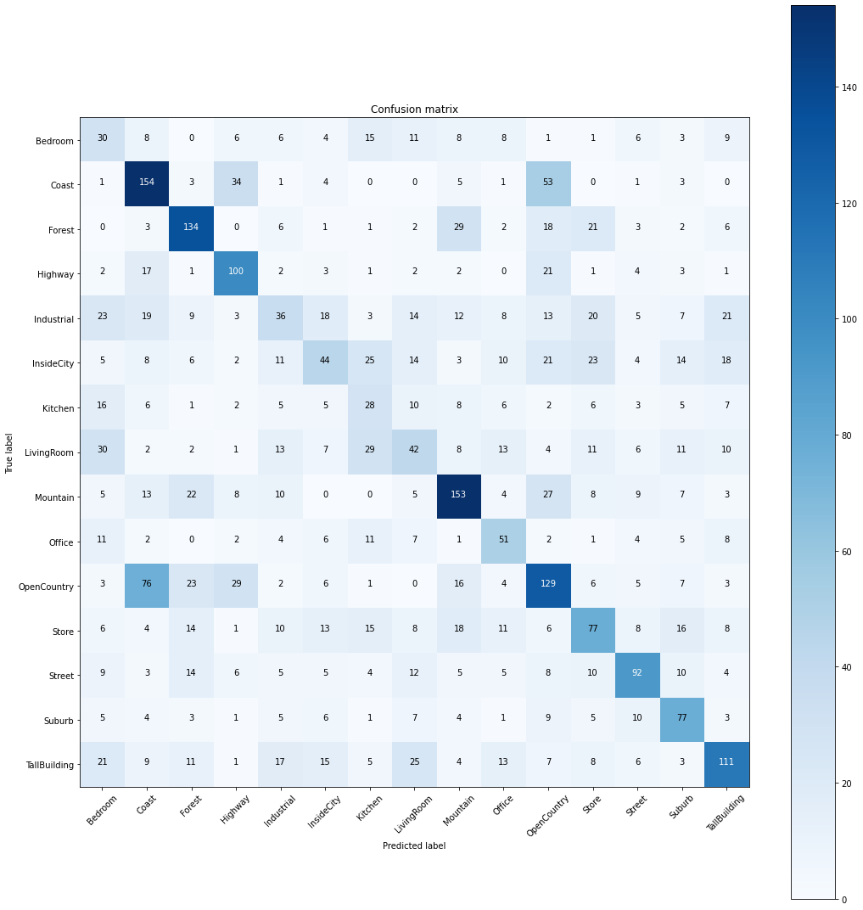
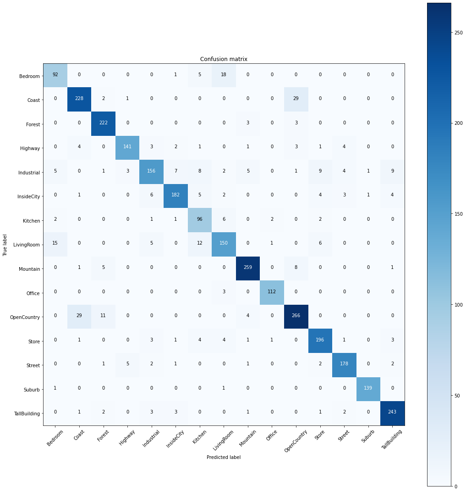

Problem statement
Computer vision is a field of artificial intelligence that enables computers and
systems to derive meaningful information from digital images, videos and other
visual inputs, and based on those inputs, it can take action.
The aim of this project is to implement an image classifier based on convolu-
tional neural networks. Starting by implementing a simple shallow network and
then refining it until a pre-trained ResNet18 is implemented, showing at each step
how the accuracy of the model improves. The provided dataset (from [Lazebnik
et al., 2006]) contains 15 categories.

# CNN Layers

Convolutional neural networks have three main types of layers, which are:

## Convolutional layer

The convolutional layer is the core building block of a CNN, and it is where the
majority of computation occurs. It requires a few components, which are input
data, a filter, and a feature map. Let’s assume that the input will be a color
image, this means that the input will have three dimensions: height, width, and
depth, which correspond to RGB in an image. We also have a feature detector,
also known as a kernel or a filter, which will move across the fields of the image,
checking if the feature is present. This process is known as a convolution.
The filter is applied to an area of the image, and a dot product is calculated
between the input pixels and the filter. This dot product is then fed into an
output array. Afterwards, the filter shifts by a stride, repeating the process until
the kernel has crossed the entire image. The final output from the series of dot
products from the input and the filter is known as a feature map, activation map,
or a convolved feature.
There are three hyperparameters which affect the volume size of the output
that need to be set before the training of the neural network begins. These
include:

* The number of filters affects the depth of the output.
2
* Stride is the distance, or number of pixels, that the kernel moves over the
input matrix.
* Padding, this sets all elements that fall outside of the input matrix, pro-
ducing a larger or equally sized output. There are three types of padding:
Valid padding, Same padding and Full padding.

After each convolution operation, it is applies a transformation to the feature
map (ReLu, Sigmoid, Than, ...), introducing nonlinearity to the model.
The convolutional layer converts the image into numerical values, allowing
the neural network to interpret and extract relevant patterns.

## Pooling layer

The pooling operation performs a filter on the input, but the difference is that this
filter has no weights. Instead, it applies an aggregation function to the values
within the considered field, populating the output array. There are two main
types of pooling:

* Max pooling: As the filter moves across the input, it selects the pixel with
the maximum value to send to the output array.
* Average pooling: As the filter moves across the input, it calculates the
average value within the considered field to send to the output array.

It has a number of benefits to the CNN. They help to reduce complexity,
improve efficiency, and limit risk of overfitting.

## Fully-connected layer

The name of the fully connected layer describes itself appropriately. As already
mentioned, in partially connected layers, the pixel values of the input image are
not directly connected to the output layer. In the fully connected layer, however,
each node of the output layer connects directly to a node of the previous layer.
This layer performs the task of classification based on the features extracted
through the previous layers and their various filters. While convolutional and
pooling layers tend to use activation functions, FC layers usually exploit a softmax
activation function to classify inputs appropriately, producing a probability of 0
to 1.

# Weight Initialization: He Normal Initialization

A proper initialization method should avoid reducing or magnifying the magni-
tudes of input signals exponentially.
He initialization refers to the first author in the paper “Delving Deep into
Rectifiers: Surpassing Human-Level Performance on ImageNet Classification”.
This method is similar to Xavier initialization, with the factor multiplied
by two. In this method, the weights are initialized keeping in mind the size
of the previous layer which helps in attaining a global minimum of the cost
function faster and more efficiently.The weights are still random but differ in
range depending on the size of the previous layer of neurons. This provides a
controlled initialization hence the faster and more efficient gradient descent.
He initialization initializes the bias vectors of a neural network to 0 and the
weights to random numbers drawn from a Gaussian distribution where the mean
is 0 and the std
√︂2
nl, where nlis the dimension of the previous layer.

$wl∼N (0, 2
nl
); b = 0. (1)$

# Dataset
The provided dataset from [Lazebnik et al., 2006], contains 15 categories (office,
kitchen, living room, bedroom, store, industrial, tall building, inside city, street,
highway, coast, open country, mountain, forest, suburb), and is already divided
in training set and test set.
So we divided the training set provided into 85% for the actual training set
and 15% to be used as the validation set.

# Results

For the following results, in all networks, a mini-batch of size 32 was used and the
initial weights were initialised using He Normal Initialisation (see above). Also,
a cross-entropy loss was used to define the cost function.
Stopping criteria: An early stop is used as a stopping criterion, whereby
when an increase in the validation error is observed or this stabilises, training is
interrupted and the best parameters are stored and returned.
Learning rate Schedules: Learning rate schedules seek to adjust the
learning rate during training by reducing the learning rate according to a pre-
defined schedule. We use a exponential decay.

## Shallow Network
Since the input image is 64×64, the images had to be resized in order to feed
them to the network. Anisotropic scaling was implemented. Also, a gray scaling
process of converting an image from the color spaces RGB (3 channels) to shades
of gray (1 channel) was applied.
As optimiser, we used a Stochastic Gradient Descent.

## Improved Network

For this Networks data augmentation was used. In particular, it was applied
randomly, only to the training set, a vertical and horizontal Flip. This tecnique
make the dataset more robust, and improve the performance.
We also introduced a Batch Normalization before the activation functions,
with the aim of reducing the internal covariance shift and making the model more
robust.
Finally we add some dropout layer to improve regularization.
As optimiser, we used Adam optimizer.

## Transfer learning: Finetuning using ResNet18

In finetuning, we start with a pre-trained model and update all of the model’s
parameters for our new task, in essence retraining the whole model. In our case a
pre-trained ResNet18 was used. Since ResNet18 takes images of size 256x256 as input, we had to resize our images before feeding the training. Also in this case
we used the Augmented dataset. The workflow is:

* Initialize the pretrained model
* Reshape the final layer(s) to have the same number of outputs as the number
of classes in the new dataset
* Define for the optimization algorithm which parameters we want to update
during training
* Run the training step

# Loss and Accuracy comparison

According to the stop criteria, the best parameters are stored after the training is
stopped. In the following the best result for validation accuracy during training:

* Shallow Network: Best val Acc: 0.426667
* Improved Network: Best val Acc: 0.729412
* Pre-trained Network: Best val Acc: 0.882353

# Family-Image-Classifier
# Family-Image-Classifier
